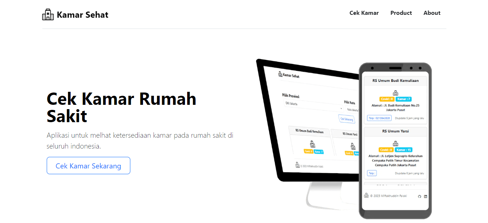

<h3 align="center"> Kamar Sehat</h3>

<p align="center">


<!--   -->
<!--  -->

<!--  -->


</p>



## Usage
1. Clone this repository
```bash
git clone https://github.com/kikuKeii/rumah-sehat.git
```
2. Install packages (use `yarn` or `npm`)
```bash
npm install 
```
or
```bash
yarn install
```
3. Start server
```bash
npm next dev
```
or
```bash
yarn next dev 
```

Open [http://localhost:3000](http://localhost:3000) with your browser to see the result.

## Documentation
__Base Path__ : localhost:3000</br>
__Try__ : https://vercel.app

| Endpoint | Params | Description |
| -------- | ------ | -----------|
| / | - | Landing Page|
| /cek | - | To Check Bed Availibility |

## Data Source

<a href="https://github.com/satyawikananda/rs-bed-covid-indo-api" target="_blank" rel="noopener noreferrer">Satya Wikananda</a>


## Deploy on Vercel
[](/#)

## Support

[](https://ko-fi.com/X8X031K5P)

If you think this is useful for your learning process or your project. Please support me by giving <a href="https://ko-fi.com/X8X031K5P" title="Ko-fi" target="_blank">Ko-Fi</a>.

## Contributing

Pull requests are welcome. For major changes, please open an issue first to discuss what you would like to change.

## License

[MIT](https://github.com/kikuKeii/kamar-sehat-app/blob/master/licence)

```
MIT License

Copyright (c) 2023 Miftakhuddin Falaki

Permission is hereby granted, free of charge, to any person obtaining a copy
of this software and associated documentation files (the "Software"), to deal
in the Software without restriction, including without limitation the rights
to use, copy, modify, merge, publish, distribute, sublicense, and/or sell
copies of the Software, and to permit persons to whom the Software is
furnished to do so, subject to the following conditions:

The above copyright notice and this permission notice shall be included in all
copies or substantial portions of the Software.

THE SOFTWARE IS PROVIDED "AS IS", WITHOUT WARRANTY OF ANY KIND, EXPRESS OR
IMPLIED, INCLUDING BUT NOT LIMITED TO THE WARRANTIES OF MERCHANTABILITY,
FITNESS FOR A PARTICULAR PURPOSE AND NONINFRINGEMENT. IN NO EVENT SHALL THE
AUTHORS OR COPYRIGHT HOLDERS BE LIABLE FOR ANY CLAIM, DAMAGES OR OTHER
LIABILITY, WHETHER IN AN ACTION OF CONTRACT, TORT OR OTHERWISE, ARISING FROM,
OUT OF OR IN CONNECTION WITH THE SOFTWARE OR THE USE OR OTHER DEALINGS IN THE
SOFTWARE.
```

## Learn More

To learn more about Next.js, take a look at the following resources:

- [Next.js Documentation](https://nextjs.org/docs) - learn about Next.js features and API.
- [Learn Next.js](https://nextjs.org/learn) - an interactive Next.js tutorial.

You can check out [the Next.js GitHub repository](https://github.com/vercel/next.js/) - your feedback and contributions are welcome!

Check out  [Next.js deployment documentation](https://nextjs.org/docs/deployment) for more details.
